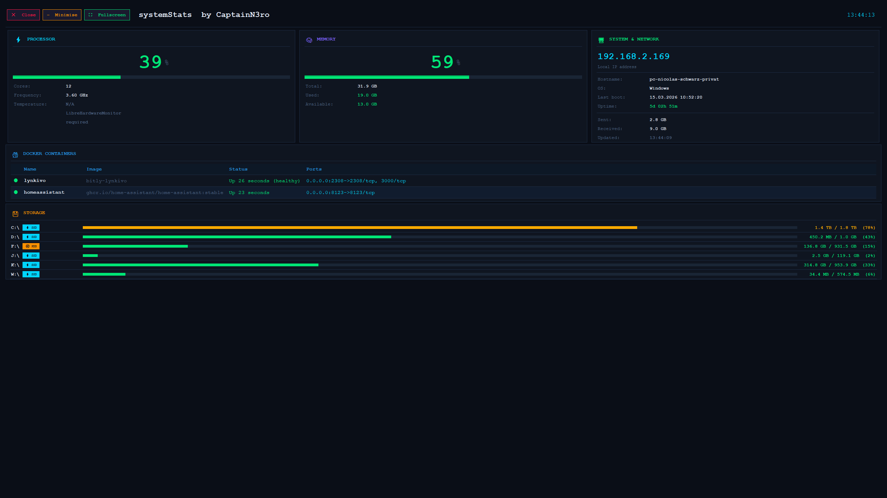

# systemStats by CaptainN3ro

> A fullscreen, dark-mode system monitoring dashboard built with pure Python and Tkinter — no web server, no Electron, no bloat.


---

## Screenshot



---

## Features

- **CPU panel** — real-time usage percentage, core count, clock frequency, and temperature (colour-coded: green → orange → red)
- **Memory panel** — RAM usage with total / used / available breakdown
- **System & Network panel** — local IP, hostname, OS, last boot time, uptime, total bytes sent/received
- **Storage panel** — per-disk usage bar, SSD / NVMe / HDD / eMMC type badge, free space
- **Docker panel** — live table of running containers (name, image, status, ports) — hidden automatically when Docker is not installed
- **Screensaver** — animated pulsing ring with OS logo after 5 minutes of inactivity; dismiss with any mouse movement or keypress
- **Fullscreen by default** — press `F11` to toggle, `Escape` to exit fullscreen
- **Auto-refreshes** every 60 seconds in a background thread; clock ticks every second
- **Cross-platform** — works on Windows, Linux, and macOS with a single script

---

## Requirements

| Dependency | Notes |
|---|---|
| Python 3.8+ | Tested on 3.9, 3.10, 3.11, 3.12 |
| `psutil` | Auto-installed on first run |
| `tkinter` | Bundled with most Python distributions (see below if missing) |
| `docker` CLI | Optional — Docker panel is hidden if not present |

### Windows — CPU temperature

CPU temperature on Windows requires one of the following to be **installed and running**:

- [LibreHardwareMonitor](https://github.com/LibreHardwareMonitor/LibreHardwareMonitor) *(recommended)*
- [OpenHardwareMonitor](https://openhardwaremonitor.org/)

Without these, the temperature field shows `N/A — LibreHardwareMonitor required`.

### Installing tkinter

| OS | Command |
|---|---|
| Debian / Ubuntu | `sudo apt install python3-tk` |
| Fedora | `sudo dnf install python3-tkinter` |
| Arch | `sudo pacman -S tk` |
| macOS | Comes with the official python.org installer; `brew install python-tk` for Homebrew |
| Windows | Bundled with the official Python installer (enable "tcl/tk" during setup) |

---

## Installation

```bash
# 1. Clone the repository
git clone https://github.com/CaptainN3ro/systemStats.git
cd systemStats

# 2. (Optional) create and activate a virtual environment
python -m venv .venv
source .venv/bin/activate        # Linux / macOS
.venv\Scripts\activate.bat       # Windows

# 3. Install the only dependency
pip install psutil

# 4. Run
python systemStats.py
```

> **psutil is auto-installed** if missing, so step 3 is optional for a quick first run.

---

## Usage

```
python systemStats.py
```

| Key / Action | Effect |
|---|---|
| `F11` | Toggle fullscreen |
| `Escape` | Exit fullscreen |
| Mouse move / any key | Dismiss screensaver |
| Close button (✕) | Quit the application |
| Minimise button (–) | Minimise to taskbar |

---

## Configuration

All tuneable constants live at the top of the `Dashboard` class:

```python
IDLE_TIMEOUT = 300      # seconds of inactivity before screensaver (default: 5 min)
REFRESH_MS   = 60_000   # data refresh interval in milliseconds (default: 1 min)
```

Edit `systemStats.py` and change these two values to your liking — no config file needed.

---

## Project Structure

```
systemStats/
├── systemStats.py   # single-file application — everything lives here
├── README.md
└── LICENSE
```

The project is intentionally kept as a **single file** so it can be copied anywhere and run without any project structure.

---

## How It Works

```
┌─────────────────────────────────────────────────────┐
│                   Dashboard (tk.Tk)                 │
│                                                     │
│  _refresh_data()  ──►  Thread: gather_data()        │
│        ▲                     │                      │
│        │              psutil / subprocess           │
│   REFRESH_MS               │                      │
│        │              _data dict (Lock)             │
│        └──────────────────► _update_ui()            │
│                             │                       │
│          ┌──────────────────┼────────────────────┐  │
│          ▼          ▼       ▼        ▼           ▼  │
│       CPU panel  RAM  Sys+Net  Docker  Disks panel  │
└─────────────────────────────────────────────────────┘
```

1. On startup the UI is built and a background thread calls `gather_data()`.
2. `gather_data()` collects all metrics (CPU, RAM, disks, network, Docker) using `psutil` and subprocess calls.
3. The result is stored in `self._data` under a `Lock`.
4. `_update_ui()` is called on the main thread via `self.after(0, …)` and redraws each panel.
5. Steps 1–4 repeat every `REFRESH_MS` milliseconds.
6. The clock label is updated independently every second.
7. A separate `_check_screensaver()` loop runs every 50 ms to detect inactivity and animate the screensaver canvas.

---

## Temperature Support Matrix

| OS | Method | Notes |
|---|---|---|
| Linux | `psutil.sensors_temperatures()` | Requires `lm-sensors` on most distros |
| Windows | LibreHardwareMonitor WMI | App must be running in the background |
| Windows | OpenHardwareMonitor WMI | Fallback if LibreHW is absent |
| Windows | ACPI Thermal Zone (WMI / PowerShell) | Built-in, but often inaccurate |
| macOS | `sudo powermetrics --samplers smc` | Requires sudo |

---

## Disk Type Detection

| OS | Method |
|---|---|
| Linux | Reads `/sys/block/<dev>/queue/rotational`; device name check for NVMe / eMMC |
| Windows | `Get-PhysicalDisk` + `Get-Partition` via PowerShell, cached at startup |
| macOS | `diskutil info` — parses `Solid State` / `Rotational` keywords |

---

## Contributing

Pull requests are welcome! Please:

1. Fork the repo and create a feature branch (`git checkout -b feature/my-feature`)
2. Keep changes self-contained inside `systemStats.py` where possible
3. Test on at least one OS before submitting
4. Open a PR with a clear description of what was changed and why

For bugs, please open a GitHub Issue and include your OS, Python version, and the full traceback.

---

## Author

**CaptainN3ro** — [github.com/CaptainN3ro](https://github.com/CaptainN3ro)
